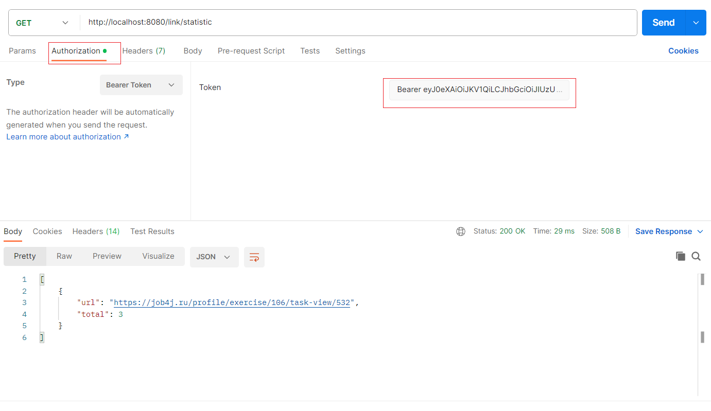

job4j_Url_ShortCut
=================

## Описание
Это приложение - реализация Rest-сервиса:

- К сервису обращаются сайты, регистрируются в нём. После регистрации сайта - ему выдаются сгенерированные логин и пароль;
- Авторизация настроена через JWT;
- После регистрации в сервисе авторизованный пользователь может отправлять ему ссылки, а получать - закодированные;
- Когда сайт отправляет закодированную ссылку, в ответ приходит ассоциированная ссылка и статус 302. Данная процедура доступна без авторизации;
- Ведется статистика вызовов каждого адреса: список всех ссылок и количество запросов к ним через закодированную ссылку.

## Используемые технологии:
- JDK17
- Spring Boot 2.7
- Spring Security
- Spring Data JPA
- Maven 3.9
- Liquibase 3.6.2
- PostgreSQL 13.3
- Log4j 1.2.17
- Slf4j 2.0.5
- Lombok

## Использование

### 1. Регистрация сайта в системе
Чтобы зарегистрировать сайт в системе нужно отправить запрос

*POST   /account/sign-up*

С телом JSON-объекта

*{"site" : "job4j.ru"}*

В ответ получаем флаг регистрации(если сайт уже зарегистрирован в сервисе - он будет "false"), логин и пароль

### 2. Авторизация через JWT
Пользователь отправляет логин и пароль в запросе

*POST   /account/login*

Генерируется токен

### 3. Преобразование ссылки
Авторизованный пользователь делает запрос

*POST   /link/convert*

С телом JSON объекта

*{"url": "https://job4j.ru/profile/exercise/106/task-view/532 "}*

В ответ от сервера получает преобразованную ссылку

### 4. Переадресация
Отправляем запрос

*GET   /link/redirect/преобразованная ссылка*

Получаем ассоциированный адрес, статус ответа 302. Доступно без авторизации

### 5. Статистика
Можно посмотреть количество вызовов redirect для каждого адреса

*GET   /link/statistic*

Доступно для авторизованных пользователей

## Контактная информация:
